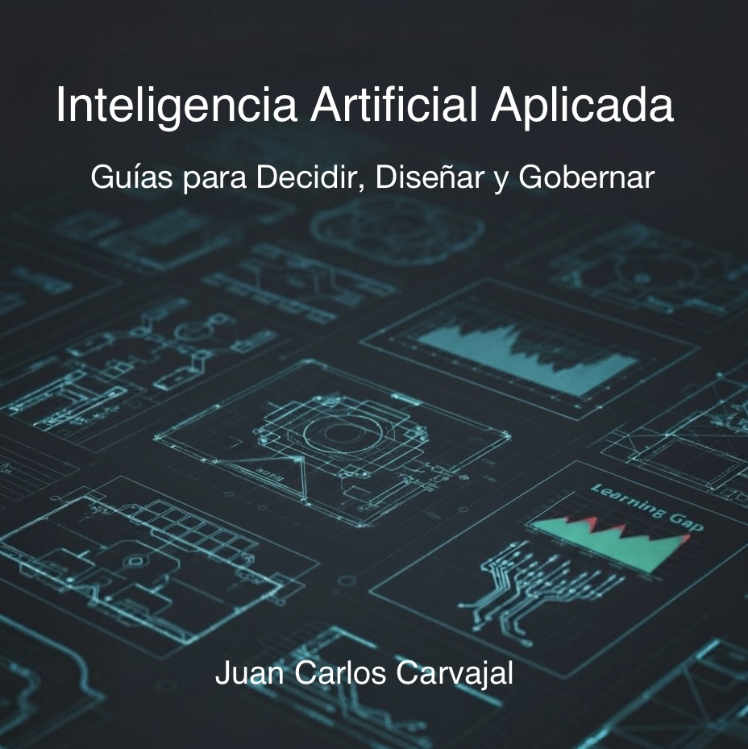

# Inteligencia Artificial Aplicada
### Guías para Decidir, Diseñar y Gobernar

**Versión 1.1 (Noviembre 2025)**

**Autor:** [Juan Carlos Carvajal](https://www.jccarvajal.com/)

---

### Descripción del Proyecto

Esta obra no es un libro tradicional; es una **documentación técnica y estratégica** diseñada para cerrar la brecha entre la experimentación con Inteligencia Artificial y su implementación productiva en organizaciones.

Mientras el mercado se enfoca en las herramientas ("qué modelo usar"), este repositorio se enfoca en el **criterio de ingeniería y gestión** ("cómo construir sistemas fiables").

El objetivo es proporcionar un **Marco de GRC (Gobernanza, Riesgo y Cumplimiento)** que permita a líderes técnicos y estratégicos:
1.  **Decidir** con base en la viabilidad técnica y el valor de negocio (no en el *hype*).
2.  **Diseñar** sistemas cognitivos robustos utilizando patrones de ingeniería (RAG, Agentes, CoT).
3.  **Gobernar** la operación mitigando riesgos de seguridad, alucinaciones y costos.

---

### Tesis Central: GRC y Sinergia

La premisa fundamental es que la IA generativa actual opera como un "Sistema 1" (rápido, probabilístico, sin juicio). Para su implementación segura, requiere una arquitectura que delegue la ejecución táctica pero mantenga la responsabilidad estratégica ("Sistema 2") en el operador humano.

Este repositorio propone el principio de **"Delegar, no Abdicar"**, implementado a través de controles técnicos de Ciberseguridad y políticas de uso que aseguran la trazabilidad y la ética en la toma de decisiones.

---

### Estructura de la Documentación

El contenido está organizado modularmente siguiendo el ciclo de vida de un proyecto de IA.

#### 🏛️ Introducción
Marco conceptual y filosófico.

* [Nota al Lector](./nota-al-lector.md)
  *Alcance y definición de roles (Arquitecto vs. Profesional).*
* [Prólogo: Fundación](./prologo.md)
  *Bases teóricas (Kahneman, Dreyfus, Taleb).*
* [Ideas Centrales](./ideas-centrales.md)
  *Resumen ejecutivo de los conceptos clave.*

#### 🧱 Bloque 1: Fundamentos Técnicos (Cómo funciona)
Comprensión de las capacidades y límites del motor.

* [Guía 01: Ingeniería de Prompts](./guias/01-Ingenieria-Prompts.md)
  *Diseño de instrucciones deterministas.*
* [Guía 02: Ingeniería de Contexto](./guias/02-Ingenieria-Contexto.md)
  *Gestión de memoria y limitaciones del Transformer.*
* [Guía 03: Estrategia de Datos](./guias/03-Estrategia-Datos.md)
  *Gobernanza de la fuente y vectores (RAG).*

#### 🏗️ Bloque 2: Ingeniería y Construcción (Cómo se hace)
Arquitecturas para sistemas autónomos.

* [Guía 04: Ingeniería de Agentes](./guias/04-Ingenieria-Agentes.md)
  *Orquestación y Ciclos ReAct.*
* [Guía 05: Sistemas Cognitivos](./guias/05-Sistemas-Cognitivos.md)
  *Patrones de razonamiento (Chain of Thought, Tree of Thoughts).*
* [Guía 06: Prototipado y Experimentación](./guias/06-Prototipado.md)
  *Metodología de validación rápida.*

#### 🎛️ Bloque 3: Operación y Gobernanza (Cómo se gestiona)
El paso a producción: seguridad, calidad y monitoreo.

* [Guía 07: Gobernanza de IA](./guias/07-Gobernanza.md)
  *Ciberseguridad y control de riesgos (Inyección, Shadow AI).*
* [Guía 08: Evaluación y QA](./guias/08-Evaluacion-Calidad.md)
  *Métricas objetivas y "Golden Sets".*
* [Guía 09: Industrialización](./guias/09-Industrializacion.md)
  *LLM-Ops y escalabilidad.*

#### 🤝 Bloque 4: Impacto y Estrategia (Cómo nos afecta)
La dimensión humana y de negocio.

* [Guía 10: Ética y Confianza](./guias/10-Humanidad-Etica.md)
  *Licencia Social y Sinergia S1/S2.*
* [Guía 11: Pensamiento Algorítmico](./guias/11-Aprender-A-Pensar.md)
  *Nuevas competencias para el equipo humano.*
* [Guía 12: Estrategia y Valor](./guias/12-Estrategia-Valor.md)
  *Modelos de negocio y fosos competitivos.*

#### 🔭 Bloque 5: La Expansión (Cómo proyectamos)
Prospección tecnológica.

* [Guía 13: Perspectivas](./guias/13-Perspectivas-Futuro.md)
  *Web Agéntica y nuevos paradigmas.*

#### 🏁 Conclusión
El cierre del ciclo estratégico.

* [Cierre: De la Fundación a la Expansión](./conclusion.md)
  *Síntesis del marco GRC y el mandato de vigilancia continua.*

---

### 🛠️ Anexos y Herramientas
Recursos prácticos organizados por su función en el ciclo del proyecto.

#### 📋 Estrategia y Gobernanza
Herramientas para el "Día 0": Definición y Permisos.

* [Anexo 01: Formulación de Proyectos](./anexos/01-Formulacion-Evaluacion.md)
  *Canvas de viabilidad técnica, ética y financiera ("Screening").*
* [Anexo 02: Política Institucional](./anexos/02-Politica-Institucional.md)
  *Marco regulatorio base para el uso responsable de IA.*

#### 📐 Arquitectura y Diseño
Herramientas para la toma de decisiones técnicas y de compra.

* [Anexo 03: Modelos y Mercado](./anexos/03-Modelos-Mercado.md)
  *Matriz para elegir entre APIs, Open Source y Agentes-como-Servicio.*
* [Anexo 04: Blueprints](./anexos/04-Blueprints.md)
  *Patrones de arquitectura y casos de uso reales (Soporte, Legal, Estrategia).*
* [Anexo 05: Ajuste Fino (Fine-Tuning)](./anexos/05-Ajuste-Fino.md)
  *Guía técnica para decidir entre RAG y entrenamiento especializado.*

#### 🧰 Caja de Herramientas
Recursos listos para copiar y usar en producción.

* [Anexo 06: Plantillas y Recursos](./anexos/06-Plantillas-Recursos.md)
  *Plantilla de "Prompt Maestro" y rúbricas de evaluación de calidad.*

#### 📚 Referencias y Fundamentos
Base de conocimiento para alinear equipos y profundizar el criterio.

* [Anexo 07: Glosario Técnico](./anexos/07-Glosario.md)
  *Definiciones unificadas para evitar la ambigüedad conceptual.*
* [Anexo 08: Bibliografía](./anexos/08-Bibliografia.md)
  *Papers fundacionales y reportes de industria (2017-2025).*

---

### Changelog
* **v1.1 (Noviembre 2025):** Actualización mayor. Se integran conceptos de Web Agéntica, nuevas arquitecturas de modelos y se refuerza el marco de Gobernanza de Ciberseguridad.
* Ver [Historial Completo](./changelog.md).

### Sugerencias y Mejoras
Este es un documento vivo. Si encuentras una errata o tienes una sugerencia de mejora, puedes reportarla directamente en el [Repositorio de GitHub](https://github.com/jccarvajal/IA-Aplicada).

### Licencia
El contenido se distribuye bajo licencia **CC BY-NC-ND 4.0**.
Se autoriza su uso educativo y de referencia profesional. No se permite la modificación ni el uso comercial sin autorización expresa del autor.
