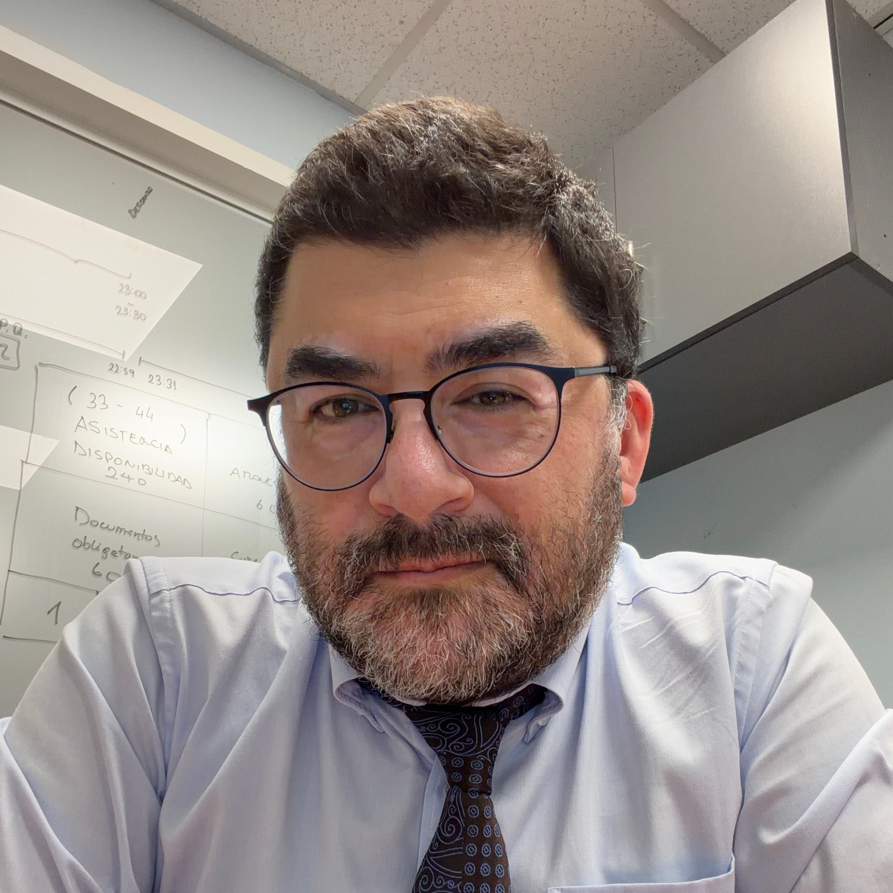

# Sobre el Autor

## Juan Carlos Carvajal
**Ingeniero Civil Electrónico, MSc. Telecomunicaciones**

*Arquitecto de Sistemas Estratégicos y de Decisión.*

*Especialista en Gobernanza de IA, Ciberseguridad y Riesgo.*

---

### Visión
Mi enfoque combina la ingeniería de sistemas robustos con la gobernanza estratégica. Este proyecto, **[Arquitectura de IA](http://ia.jccarvajal.com)**, refleja esa intersección: cerrar la brecha entre la experimentación técnica y la implementación productiva, fiable y ética en las organizaciones.

### Conecta conmigo

* 🌐 **Web Personal:** [www.jccarvajal.com](https://www.jccarvajal.com/)
* 💼 **LinkedIn:** [linkedin.com/in/jccarvajal](https://www.linkedin.com/in/jccarvajal)
* 🐙 **GitHub:** [github.com/jccarvajal](https://github.com/jccarvajal)
* 🦋 **Bluesky:** [@jccarvajal.com](https://bsky.app/profile/jccarvajal.com)
* 📧 **Correo:** [jccarvajal@gmail.com](mailto:jccarvajal@gmail.com)

---
📍 **Ubicación:** Valparaíso, Chile