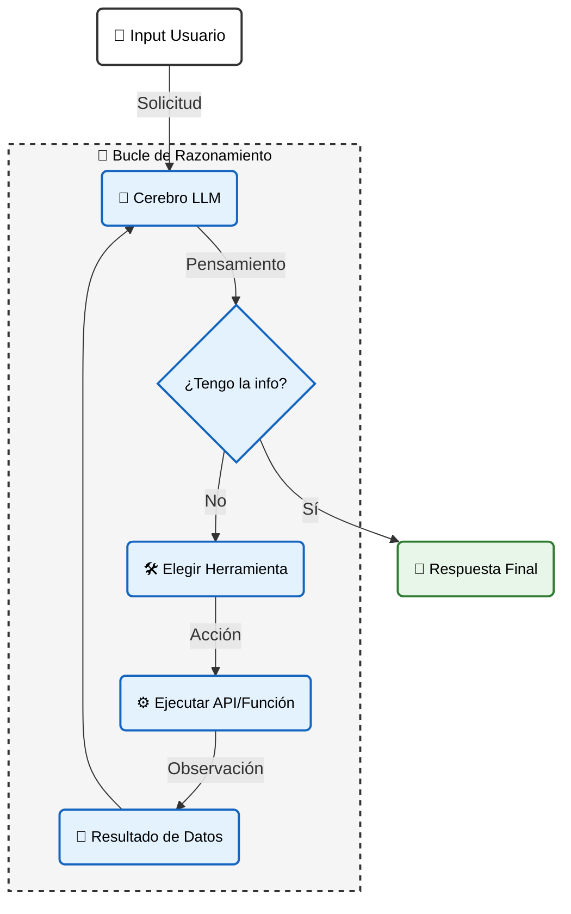

## Bloque 2: Ingeniería y Construcción (Cómo se hace)

### Guía 05: La Guía Definitiva de la Ingeniería de Agentes de IA

Subtítulo: Del "Arquitecto de Instrucciones" al "Director de Programa"

#### Introducción: La Parálisis del Oráculo y el Fin del Chatbot

En las guías anteriores, definimos la *instrucción* (Guía 02) y la *memoria* (Guía 03). Hemos construido un erudito encadenado: una IA que sabe mucho y recuerda todo, pero no puede hacer nada.

Esta limitación explica el cementerio de proyectos de IA corporativos: las empresas siguen construyendo **Oráculos pasivos**, chatbots glorificados que esperan preguntas, cuando el mercado exige **Obreros autónomos**.

La diferencia entre un juguete y una herramienta es la **Agencia**.

* Un **Chatbot** te dice cómo reservar un vuelo.
* Un **Agente** te envía la tarjeta de embarque a tu correo.

En esta guía, rompemos el cristal. Dejamos de pedir respuestas para empezar a exigir resultados. Bienvenido a la ingeniería de la fuerza laboral digital.

---

#### Conceptos Fundamentales

**1\. La Anatomía de la Agencia (Cerebro + Manos)**

Para lograr este salto de "conversar" a "trabajar", dejamos de tratar al LLM como el producto final y lo convertimos en un componente de un sistema mayor. Arquitectónicamente, un Agente se distingue por tener componentes que un Chatbot no tiene:

* **El Cerebro (El LLM):** Su rol cambia. Ya no es una enciclopedia para recitar datos; es un motor de razonamiento para tomar decisiones.
* **Las Manos (Herramientas/Tools):** Son funciones de código (APIs, scripts Python) que conectan al cerebro con el mundo exterior (buscar en Google, leer archivos, enviar emails). Sin herramientas, la IA es un "cerebro en un frasco".
* **El Corazón (El Bucle):** A diferencia de un chat que responde y se detiene, un agente opera en un ciclo continuo hasta cumplir su objetivo.

**2\. El "Motor" del Agente: El Ciclo ReAct (Razonar \+ Actuar)**

Esto es lo más importante. Un agente no solo da una respuesta y se detiene. Opera en un bucle (loop) hasta que cumple el objetivo. Este ciclo se conoce comúnmente como **ReAct**, un patrón que combina el Razonamiento (Reason) con la Acción (Act).



En la arquitectura moderna (2025), exigimos lo que llamamos el **"Patrón de Pensamiento Visible"**. No queremos que el agente actúe a ciegas; queremos ver su lógica estructurada antes de que toque una herramienta.

Así es como se ve la traza de un agente moderno:

* 👤 Usuario:
  ```text
  Busca el pronóstico del clima de hoy en Valparaíso y envíame un resumen por email.
  ```

* El agente ahora debe "razonar" y "actuar" en un bucle:

  *CICLO 1: Obtener Información*

  * 💭 Agente (Razonamiento Estructurado):
    ```xml
    <pensamiento>
      Objetivo: Buscar clima + Enviar email.
      Estado Actual: No tengo datos del clima.
      Decisión: Debo invocar la herramienta 'buscar_clima' antes de poder redactar el correo.
    </pensamiento>
    ```
  * ⚙️ Agente (Actúa):
    ```yaml
    acción: buscar_clima
    argumentos:
      ciudad: Valparaíso
    ```
  * 💭 Agente (Observación):
    ```text
    { 'max': '18C', 'min': '11C', 'estado': 'Nublado' }
    ```
  * El bucle continúa porque el objetivo final no está cumplido

  *CICLO 2: Ejecutar Acción Final*

  * 💭 Agente (Razonamiento Estructurado):
    ```xml
    <pensamiento>
      Dato recibido: 18C, Nublado.
      Condición: Tengo toda la información necesaria.
      Decisión: Proceder a enviar el correo.
    </pensamiento>
    ```
  * ⚙️ Agente (Actúa):
    ```yaml
    acción: enviar_email
    argumentos:
      destinatario: usuario@ejemplo.com
      cuerpo: "Clima de hoy en Valparaíso: 18C, nublado."
    ```
  * 💭 Agente (Observación):
    ```text
    { 'status': 'enviado' }
    ```
  * El bucle se detiene.

  *Respuesta Final al Usuario:*
  * 💬 Agente (Responde):
    ```text
    Listo. El clima en Valparaíso es de 18C, parcialmente nublado. Te he enviado el resumen.
    ```

> **Nota de Arquitectura:** Independientemente del modelo (OpenAI, Gemini, Claude), la arquitectura robusta exige que el agente "muestre su trabajo". Separar el razonamiento (`<pensamiento>`) de la acción final es vital para la auditoría y depuración.

**3. Las Herramientas (Tools): Las "Manos" del Agente**

Las herramientas son funciones de código (APIs, scripts Python) que conectan el cerebro de la IA con el mundo digital. Sin herramientas, el modelo es solo un "conversador"; con ellas, se convierte en un "actor" capaz de ejecutar tareas reales.

*Ejemplos:* `buscar_en_google()`, `leer_archivo()`, `consultar_API_del_clima()`.

---

#### El Dilema Central: La "Correa" del Agente (Autonomía vs. Control)

Aquí reside el verdadero arte de la ingeniería. El *trade-off* ya no es solo costo vs. latencia, sino **Autonomía vs. Seguridad**.

* **Correa Suelta (Autonomía Total):**
  ```text
  "OK Agente, aquí tienes $100 y mi tarjeta de crédito. Reserva el mejor viaje."
  ```
  * *Riesgo Antiguo (Alucinación):* Poderoso, pero aterrador. El agente podría reservar el hotel equivocado o enviar un email vergonzoso.
  * *Riesgo Moderno (Bucle Infinito):* Con los nuevos modelos persistentes, el agente podría entrar en un bucle tratando de encontrar el "vuelo perfecto" eternamente, gastando presupuesto y recursos sin detenerse.
  * *Mitigación:* Aquí es donde implementamos **"Circuit Breakers"** (límites duros de iteración, ej. `max_steps=15`) para cortar la ejecución forzosamente.

* **Correa Corta (Control Total):**
  ```text
  "OK Agente, dime tu primer paso.... OK, apruebo ese paso, ejecútalo.... OK, muéstrame el resultado.... Ahora, dime tu segundo paso."
  ```
  * *Riesgo:* 100% seguro, pero lento y tedioso. Básicamente, volvemos a la ingeniería de prompts manual y perdemos el beneficio de tener un trabajador digital.

**El Buen Enfoque:** El juicio de ingeniería está en diseñar un sistema que sepa cuándo actuar solo y cuándo detenerse para pedir validación humana. Esto nos lleva directamente a nuestra primera estrategia.

---

#### Estrategias Fundamentales de Ingeniería de Agentes

Estas son las técnicas para dirigir a nuestros nuevos “trabajadores digitales” sin causar un desastre. A continuación, revisaremos tres estrategias fundamentales: *El Agente con "Humano-en-el-Bucle"*, *La Orquesta de Agentes (El Director de Programa)* y *El Agente Especializado (El Flujo de "Auto-Prompting")*.

---

#### Estrategia 1: El Agente con "Humano-en-el-Bucle" (Human-in-the-Loop)
Esta es la solución más práctica y segura al dilema de la "correa".

* **¿Qué es?** Es diseñar un agente que tiene "puntos de control" obligatorios. El agente ejecuta sus ciclos ReAct (Razonar-Actuar-Observar) de forma autónoma, excepto en acciones críticas.  
* **¿Por qué funciona?** Le das autonomía para lo trivial (buscar, analizar, redactar) pero le quitas autonomía para lo peligroso (gastar dinero, enviar comunicaciones, borrar datos).  
* **Ejemplo de Punto de Control:** El agente redacta el email y, en lugar de enviarlo automáticamente, se detiene y presenta una interfaz al usuario: *"He redactado el borrador para el cliente. ¿Deseas [Enviar], [Modificar] o [Cancelar]?"*

---

#### Estrategia 2: La Orquesta de Agentes (Router y Workers)
Esta es la estrategia de escalabilidad más importante. Ya no pensamos en un solo agente que lo hace todo. Pensamos en un equipo de especialistas. En la arquitectura moderna, esto se conoce como el patrón **Router-Worker** (Enrutador-Trabajador).

* **Un Agente Individual es un Project Manager (PM) / Worker:** Se enfoca en un proyecto único y bien definido. Recibe un objetivo, aplica el ciclo ReAct, usa sus herramientas y entrega un resultado final.
* **Un Agente de Agentes es un Director de Programa / Router:** Este es el "Agente Jefe" o "Director". No ejecuta las tareas del día a día, sino que coordina a los "Agentes PM" especializados para alcanzar un objetivo estratégico más grande.
* **¿Cómo funciona el flujo?**
  1. **Objetivo Estratégico:** El Router (el Director) recibe la meta: *"Lanzar campaña de nuevo producto"*.
  2. **Descomposición (Routing):** El Router clasifica las necesidades y asigna tareas a agentes con contextos limpios ("pizarra en blanco"):
     * Asigna a **Agente Investigador:** *"Analiza el público objetivo y la competencia"*
     * Asigna a **Agente Creativo:** *"Genera los eslóganes y el contenido visual"*
     * Asigna a **Agente de Redes:** *"Prepara el calendario de publicaciones"*
  3. **Síntesis:** El Router recibe los entregables de cada Worker y los integra en el resultado final (la campaña completa).
* **Beneficio:** El Router (el Director) se encarga de la estrategia de alto nivel. Cada Worker (Agente PM) trabaja con su propio contexto limpio, volviéndose más rápido, barato y preciso en su tarea especializada, evitando la confusión que tendría un solo agente intentando hacerlo todo.

---

#### Estrategia 3: El Agente Especializado (El Flujo de "Auto-Prompting")

Este es uno de los puntos de partida más simples y poderosos, que se conecta directamente con el concepto de **Meta-Prompting** (usar la IA para ayudarte a crear prompts).

* **¿Qué es?** En lugar de un agente "que lo hace todo", creas un flujo de dos pasos. Usas un "Chat 1" (El Taller) para configurar a un "Chat 2" (La Ejecución).
* **¿Por qué funciona?** El "Agente Taller" tiene el conocimiento de cómo pedir las cosas, y el "Agente Ejecutor" tiene la mente despejada para hacer el trabajo.

**Ejemplo de Flujo de Trabajo (El Taller y la Ejecución):**

Un flujo de trabajo de "auto-prompting" (self-prompting) es un ejemplo perfecto. Usas un "Chat 1" (El Taller) para que actúe como un Agente Especialista en crear prompts. Su "herramienta" es el conocimiento de la Guía 02. Luego, copias el resultado (el prompt avanzado) y lo pegas en un "Chat 2" (La Ejecución). Este segundo chat es el Agente Ejecutor, que opera con una "pizarra limpia" (contexto) y una instrucción perfecta.

En este ejemplo, tu objetivo es crear un email de marketing persuasivo.

**Paso 1: Usar el "Chat 1" (El Taller)**

Este chat está pre-cargado con el "Método de Prompting en 7 Pasos" (Guía 02).

* 👤 **Usuario (Define el Objetivo):**
  ```text
  Quiero un prompt para un email de marketing para un nuevo software de contabilidad. El público son gerentes de finanzas.
  ```

* 💭 **Agente Taller (Razonamiento Estructurado):**
  ```text
  El usuario necesita un prompt (Paso 1). Mi trabajo es aplicar los 7 Pasos (Rol, Restricciones, Formato) para construir el prompt óptimo.
  ```

* ⚙️ **Agente Taller (Actúa - Genera el Prompt):**
  ```text
  Aquí tienes un prompt de "Nivel Arquitecto", optimizado según la Guía 02:

  [INICIO DEL PROMPT GENERADO]
  Actúa como un experto en redacción de marketing B2B, especializado en el sector financiero. 
  Tu audiencia son Gerentes de Finanzas con poco tiempo.
  Tu tarea es redactar un email que presente nuestro nuevo "Software de Contabilidad Quantum".

  <restricciones>
    1. El tono debe ser profesional, directo y centrado en el ROI.
    2. El email NO debe exceder las 150 palabras.
    3. El asunto debe ser corto y persuasivo.
  </restricciones>

  <formato_requerido>
    Asunto: [Tu Asunto Aquí]
    Cuerpo: [Tu Email Aquí]
  </formato_requerido>  
  [FIN DEL PROMPT GENERADO]
  ```

**Paso 2: Usar el "Chat 2" (La Ejecución)**

Copias ese prompt generado y lo pegas en un chat nuevo. El Agente Ejecutor, al recibir instrucciones tan estructuradas y limpias, generará un resultado de calidad superior.

**Aplicación Práctica:** Podemos diseñar chats pre-cargados (agentes) para tareas específicas: un "Agente-Traductor-Legal" (cargado con glosarios legales) o un "Agente-Revisor-de-Estilo" (cargado con la guía de marca de la empresa).

> 💡 **Patrón de Ingeniería: Encapsulamiento de Contexto**
>
> La ambigüedad sintáctica es la causa raíz de la inyección de prompts. **La norma es el encapsulamiento estricto.**
>
> Independientemente del modelo (XML para Claude, Markdown para GPT), trate las instrucciones y los datos como tipos de objetos distintos. No mezcle texto plano; use contenedores explícitos (ej. `<data>...</data>` o bloques `---`) para que el modelo pueda distinguir estructuralmente entre una orden de control y el contenido a procesar.

---

#### Conclusión: De Arquitecto de Sistemas a Director de Orquesta

La evolución de nuestra maestría en IA ha sido un viaje de abstracción:

1. **Ingeniería de Prompts:** Eras un Arquitecto de Instrucciones. Tu foco era el detalle de un solo plano.  
2. **Ingeniería de Contexto:** Eras un Arquitecto de Sistemas. Tu foco era gestionar los recursos (costo, latencia, memoria) de toda la obra.  
3. **Ingeniería de Agentes:** Ahora, eres un Director de Orquesta (o Director de Programa). Tu trabajo ya no es tocar los instrumentos (escribir el prompt) ni gestionar el escenario (el contexto). Tu trabajo es definir la partitura (el objetivo final) y coordinar a tus músicos (los bucles) para que ejecuten la sinfonía de forma autónoma.

Al dominar la dirección de agentes, dejas de construir soluciones para empezar a orquestar resultados.

---

#### Nota del Arquitecto: La Frontera de la Web Agéntica

Lo que has aprendido en esta guía es cómo orquestar agentes dentro de tu propia infraestructura (tu "Intranet de Agentes"). Sin embargo, la frontera se está rompiendo rápidamente.

Protocolos emergentes como *MCP (Model Context Protocol)* o *NANDA (Networked AI Agents in Decentralized Architecture)* están permitiendo que estos agentes salgan de tu servidor para negociar con agentes de otras organizaciones en la **"Web Agéntica"**. Este salto de una orquestación interna controlada a una interoperabilidad externa abierta introduce riesgos masivos de "Lealtad" y "Seguridad" que exploraremos en profundidad en la **Guía 17: Perspectivas y Futuro**.

Por ahora, domina la orquestación interna. Es el requisito previo para sobrevivir en la web abierta que viene.
