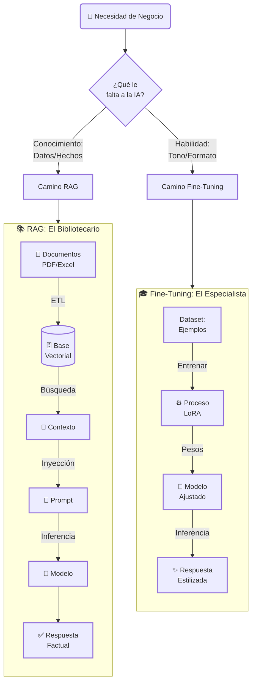

## Guia 07: Ajuste Fino y Adaptación de Modelos

Subtítulo: El Manual del "Especialista de Motores"

### Introducción: Diferenciando "Saber" de "Ser"

Existe una confusión costosa en la industria: creer que para que una IA sepa sobre tu empresa, debes re-entrenarla. Eso es falso. Para el *conocimiento*, usamos RAG.

Pero, ¿qué pasa cuando quieres cambiar el *comportamiento*? ¿Qué pasa cuando necesitas que la IA no solo cite la ley, sino que *piense* como un abogado agresivo o *escriba* con el tono exacto de tu marca?

RAG es darle libros a un estudiante. **Ajuste Fino (Fine-Tuning)** es enviarlo a la universidad durante cuatro años. Esta guía es el manual para cuando la instrucción no basta y necesitas modificar la estructura misma del "cerebro" para especializar la habilidad.

* **RAG:** Es darle a un agente genérico un libro de medicina para que lo lea.  
* **Ajuste Fino:** Es tomar a un agente genérico y mandarlo a la facultad de medicina durante 6 meses hasta que *piense* como un médico.

Tu rol aquí es el de "Especialista de Motores". No estás usando el motor, lo estás modificando.

---

### El Dilema Central: ¿Cuándo Usar RAG vs. Cuándo Usar "Fine-Tuning"?

Este es el *trade-off* más importante de la arquitectura de IA. Usar la herramienta incorrecta es caro e ineficiente.

| Característica | RAG (Gestión de Contexto) | Ajuste Fino (Adaptación de Modelo) |
| :---- | :---- | :---- |
| **Objetivo Principal** | Insertar **Conocimiento** (Hechos, Datos) | Modificar **Habilidad** (Estilo, Tono, Formato) |
| **Metáfora** | El "Bibliotecario" (Agente + Libros) | El "Especialista" (Agente que fue a la Universidad) |
| **¿Cómo Funciona?** | Añade datos al **Contexto** (la "pizarra") en tiempo real. | Modifica los **Pesos** (el "cerebro") del modelo antes de usarlo. |
| **Cuándo Usarlo** | 1\. Cuando los datos cambian constantemente (noticias, reportes). 2\. Cuando necesitas citar fuentes exactas (legal, médico). 3\. Cuando los datos son hechos (ej. "Normativa Interna"). | 1\. Cuando quieres que la IA suene como tú (Voz de Marca). 2\. Cuando quieres que razone de una forma específica (ej. "como un abogado"). 3\. Cuando quieres que formatee la salida siempre igual (ej. un JSON complejo). |
| **Ejemplo** | "Usa este PDF (RAG) para decirme qué es el BCP." | "Te he entrenado (Ajuste Fino) con 500 emails míos. Ahora, escribe como yo." |

**La Regla de Oro:** Si quieres que la IA **sepa** algo, usa RAG. Si quieres que **sea** algo, usa Ajuste Fino.

---

### Parte 1: Caso de Uso N°1 (Habilidad) - "La Voz de la Marca"

* **El Problema:** Tienes un "Agente PM de Servicio al Cliente". Usando solo Prompts (Guía 02), tienes que recordarle en cada chat tu tono de voz: "Recuerda ser empático, profesional, usar estas 5 frases clave y nunca sonar robótico." Es ineficiente y el resultado es inconsistente.  
* **La Solución (Ajuste Fino):** 
    1. **Recolectar Datos:** Juntas 1.000 ejemplos de emails "perfectos" de tu mejor agente de soporte humano (una aplicación de la Estrategia de Datos).  
    2. **Entrenar:** Haces "ajuste fino" a un modelo Open-Source (del Guía 14) con esos 1.000 ejemplos.  
    3. **Resultado:** El "cerebro" del modelo se modifica. El modelo *aprende* tu tono de voz.  
* **Beneficio:** Ahora, tu prompt (Guía 02) es 90% más corto. Ya no dices "Actúa como...". Simplemente dices: "Cliente tiene problema X. Responde." El modelo responderá automáticamente con la "Voz de la Marca" que le enseñaste. Ya no *actúa* como un agente de soporte; *es* un agente de soporte.

---

### Parte 2: Caso de Uso N°2 (Formato) - "El Experto en JSON"

* **El Problema:** Tu "Dashboard de Gobernanza" (Guía 09) necesita que tus agentes reporten su estado en un formato JSON extremadamente complejo y específico. Usar Prompts (Guía 02) es frágil; el agente a menudo olvida un campo o añade comillas extra.  
* **La Solución (Ajuste Fino):** 
    1. **Recolectar Datos:** Generas 500 ejemplos del par pregunta -> JSON_perfecto (usando la técnica de "Datos Sintéticos").  
    2. **Entrenar:** Haces "ajuste fino" a un modelo (ej. Mistral) en esa tarea específica.  
    3. **Resultado:** Creas un "Agente Especialista" ultra-barato cuya única habilidad en el mundo es generar ese JSON perfecto.  
* **Beneficio:** Fiabilidad del 99.9%. Tu "Agente Enrutador" (el "cerebro" metacognitivo) ahora puede llamar a este "especialista" barato para las tareas de formato, y reservar los "motores" caros para el razonamiento.

---

### Parte 3: Caso de Uso N°3 (Razonamiento) - "El Abogado"

* **El Problema:** Quieres un agente que razone como un abogado. RAG puede darle la ley (el "libro"), pero no le enseña a *pensar* como un abogado (la "habilidad").  
* **La Solución (Ajuste Fino):** 
    1. **Recolectar Datos:** Recolectas 50.000 ejemplos de análisis legal: (hechos_del_caso, ley_aplicable) -> (análisis_jurídico_experto) (usando "Datos Internos").  
    2. **Entrenar:** Haces "ajuste fino" a un modelo potente con este set de datos masivo.  
    3. **Resultado:** El modelo desarrolla nuevos "caminos neuronales" para el razonamiento legal.  
* **El "Stack" Híbrido (La Mejor Solución):** Ahora combinas ambas técnicas. Usas **RAG** para inyectar los hechos específicos del *nuevo* caso, y el **Ajuste Fino** se encarga de que el modelo razone sobre esos hechos como un abogado experto.

---

### Parte 4: El "Stack" Técnico (Cómo se hace sin 500 GPUs)

En el pasado, hacer "ajuste fino" requería un centro de datos. Hoy, gracias a los modelos Open-Source y nuevas técnicas, un "Ingeniero de Prototipos" (Guía 08) puede hacerlo en una sola laptop o un servidor en la nube. 
 
La clave es no re-entrenar el modelo entero. Solo "afinas" una pequeña fracción de él.

1. **El Modelo Base:** Eliges un modelo Open-Source (ej. Llama 3 8B).  
2. **La Técnica (LoRA / QLoRA):** 
    * **LoRA (Low-Rank Adaptation):** Es la técnica clave. En lugar de modificar los 8 mil millones de "perillas" (parámetros) del modelo, "congelas" el modelo original e insertas una "capa de afinación" diminuta (quizás solo el 1% del tamaño total) al lado.  
    * **El Entrenamiento:** Entrenas *solo* esa pequeña capa con tus 1.000 emails de "Voz de Marca".  
    * **QLoRA:** Una versión más eficiente de LoRA que te permite hacer esto con aún menos memoria.  
3. **El Resultado (El "Adaptador"):** Al final, tienes dos archivos:  
    1. El Modelo Base (Llama 3 8B - 16GB) Intacto.  
    2. Tu "Adaptador LoRA" (Tu "Voz de Marca" - 200MB) - Tu Propiedad Intelectual.

Cuando ejecutas tu agente, "cargas" el modelo base y "encima" le pones tu "adaptador".

* **Beneficio Estratégico:** Puedes tener un solo modelo base (Llama 3) y cincuenta "adaptadores" LoRA diferentes: "Voz de Soporte", "Voz de Marketing", "Formato JSON", "Razonador Legal". Tu "Agente Enrutador" (Guía 05) puede "cargar" el adaptador correcto para la tarea correcta, dándote una especialización profunda a un costo mínimo.

---

### Conclusión: El Verdadero Rol del "Especialista de Motores"

RAG y el Ajuste Fino no son competidores; son un equipo. 

El "Ingeniero de Prototipos" (Guía 08) usa esta "Guía de Especialización" para construir una "fábrica" industrializada (Guía 11) verdaderamente optimizada.

* Usas **RAG** para darle a tus agentes el **conocimiento** que necesitan.  
* Usas **Ajuste Fino** para darles la **habilidad**, estilo y formato que necesitas.

Un agente que tiene acceso a los libros correctos (RAG) y que además se graduó en la especialidad correcta (Ajuste Fino) es el trabajador autónomo definitivo.
