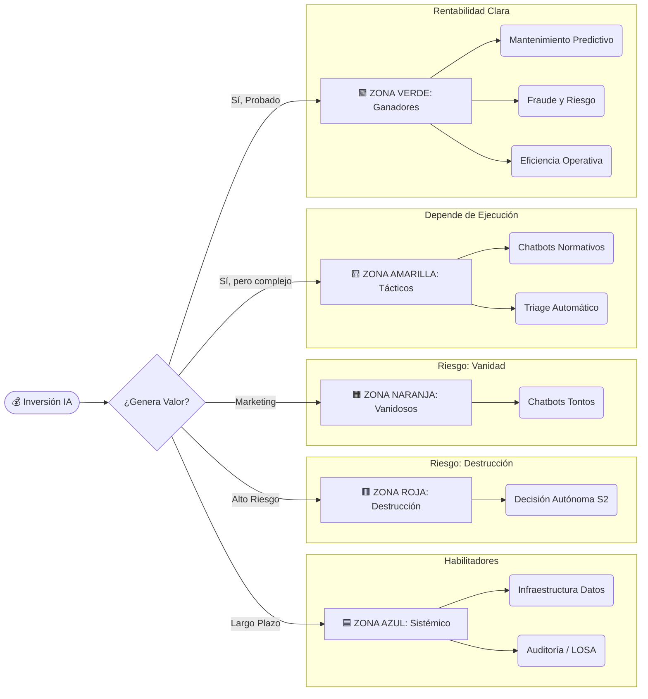

## Guía 12: El ROI de la IA: El Mapa de las Cinco Zonas

Subtítulo: Clasificación Estratégica para el "Arquitecto de Capital"

### Introducción: IA como Asignación de Capital

La Inteligencia Artificial no es magia: es una decisión de inversión. Y toda decisión de inversión —ya sea CAPEX, OPEX, horas hombre o reputación institucional— debe responder una sola pregunta fundamental:

**¿Esto crea más valor del que cuesta?**

Tras una década analizando proyectos reales, fracasos documentados, marcos regulatorios y benchmarks globales, los proyectos de IA caen sistemáticamente en un patrón universal. Ese patrón es el **Mapa de las Cinco Zonas**, un marco para priorizar inversiones, evitar trampas y maximizar el retorno público o privado.

Este mapa no es un ranking tecnológico; es una herramienta de **decisión ejecutiva**.

!!! money "El Criterio Financiero: Economía Unitaria (Unit Economics)"
    El error financiero más común es mirar el presupuesto total ("Tenemos $50k para el piloto") en lugar del costo unitario.
    
    Para aprobar un proyecto, debes calcular el margen de la tarea individual:
    
    1.  **Costo Humano Actual:** ¿Cuánto cuesta hoy responder *un* email? (Ej. $2.50 USD en tiempo).
    2.  **Costo IA Proyectado:** ¿Cuánto cuesta la inferencia + la revisión humana? (Ej. $0.15 USD).
    
    **Regla de Oro:** Si el costo de la IA (sumando la supervisión humana necesaria) se acerca al costo del humano actual, el proyecto se cancela. La tecnología es irrelevante si el margen no mejora drásticamente.

### El Mapa de las Cinco Zonas

> **Nota:** Por “Decisión Autónoma S2” nos referimos a decisiones de **alto juicio, alto impacto y consecuencias irreversibles**, que no deben ser delegadas a sistemas automáticos.

* 🟩 **Zona Verde (Ganadores):** Proyectos con ROI alto, madurez probada y beneficios financieros o físicos inmediatos.
* 🟨 **Zona Amarilla (Tácticos):** ROI positivo pero condicional; depende de la calidad de los datos y la disciplina en la ejecución.
* 🟧 **Zona Naranja (Vanidosos):** Proyectos que no destruyen la empresa, pero queman presupuesto y credibilidad.
* 🟥 **Zona Roja (Destrucción de Valor):** Inversiones con una tasa de fracaso estructural inaceptable.
* 🔵 **Zona Azul (Valor Sistémico):** Proyectos que no generan ROI financiero directo, pero construyen capacidad, soberanía y confianza a largo plazo.

> **Nota de Riesgo:** Los proyectos en la **Zona Verde (Ganadores)** suelen ser de "Riesgo Mínimo o Limitado". Los proyectos que toquen la **Zona Roja (Destrucción de Valor)** a menudo coinciden con las prohibiciones de "Riesgo Inaceptable" del **Anexo J**.

---

### 1. 🟩 Zona Verde: Los Ganadores del ROI

Son iniciativas donde la tecnología es madura y el retorno es tangible. Aquí se encuentra el dinero real. Atacan ineficiencias físicas, financieras o regulatorias concretas. Son aburridos, pero críticos.

!!! warning "La Regla del 5%: El Límite de la Supervisión"
    El "Humano-en-el-Bucle" es necesario, pero costoso. ¿Cuánto es demasiado?
    
    **La Heurística de Viabilidad:**
    Si tu arquitectura requiere que un humano revise o corrija más del **5% al 10%** de las transacciones totales para que el sistema sea seguro, el proyecto probablemente **no es viable económicamente**.
    
    * Si el humano debe revisar el 50%, no tienes una IA; tienes un borrador caro.
    * El objetivo de la ingeniería es reducir esa tasa de intervención a <1% (manejo de excepciones) para que la economía de escala funcione.

#### 1.1. Manufactura y Minería (Reducción de Opex)

El retorno proviene de la continuidad operativa y la reducción de desperdicios físicos.

* **Mantenimiento Predictivo:**
    * *Caso:* Sensores y ML detectan patrones de vibración o temperatura en activos críticos (molinos, bombas, correas) antes de la falla.
    * *Ganancia:* Evita la parada de planta no programada (costo de oportunidad masivo). Impacto típico: 30–50% menos *downtime*.
* **Visión Artificial para Control de Calidad:**
    * *Caso:* Cámaras de alta velocidad detectan microdefectos que el ojo humano no percibe.
    * *Ganancia:* Menos material desechado (*scrap*), menos devoluciones.
* **Optimización de Procesos de Fábrica:**
    * *Caso:* **Toyota** implementó agentes (sistemas automatizados especializados) para acceder a manuales y datos de reparación complejos.
    * *Ganancia:* Reducción reportada de **10,000 horas-hombre** al año, validando la tesis de eficiencia operativa pura.

#### 1.2. Logística y Retail (Capital de Trabajo)

El retorno proviene de la liberación de flujo de caja y protección de márgenes.

* **Pronóstico de Demanda (Demand Forecasting):**
    * *Caso:* Integración de variables complejas (clima, calendario, tendencias) para predecir demanda por SKU.
    * *Ganancia:* Reduce el inventario muerto en bodega y evita el quiebre de stock.
* **Precios Dinámicos (Dynamic Pricing):**
    * *Caso:* Ajuste automático de precios según elasticidad de la demanda y competencia.
    * *Ganancia:* Incremento directo del margen bruto.
* **Generación de Contenido a Velocidad (Marketing):**
    * *Caso:* **Carrefour** y **Gazelle** (Real Estate).
    * *Ganancia:* Gazelle redujo el tiempo de generación de contenido de **4 horas a 10 segundos**, y Carrefour produce videos de campaña en semanas en lugar de meses. El ROI proviene de la velocidad de ejecución.

#### 1.3. Servicios Financieros (Gestión de Riesgo)

El retorno proviene de la mitigación de pérdidas y eficiencia.

* **Detección de Fraude Contextual:**
    * *Caso:* Análisis de biometría del comportamiento e historial transaccional en tiempo real.
    * *Ganancia:* Reduce el fraude real y, crucialmente, disminuye los falsos positivos que molestan al cliente.
* **Recuperación de Deuda Inteligente:**
    * *Caso:* Consultora **atmira** y su plataforma SIREC.
    * *Ganancia:* Mejora de las tasas de recuperación de deuda en un **30-40%**, demostrando impacto directo en el flujo de caja.
* **Retención y Servicio al Cliente (Escala):**
    * *Caso:* **ING Bank** implementó chatbots de GenAI para mejorar las respuestas a consultas de clientes, y **Scotiabank** transformó sus operaciones bancarias globales.
    * *Ganancia:* Mejora en la retención de clientes mediante respuestas inmediatas y precisas, reduciendo la fuga hacia la competencia por mala atención.

#### 1.4. Sector Público (Eficiencia y Recaudación)

El retorno se mide en capacidad de ejecución estatal y "valor público".

* **Fiscalización Inteligente en Fronteras:**
    * *Caso:* Aduanas utilizan modelos para detectar patrones anómalos en importaciones/exportaciones y rutas inusuales.
    * *Ganancia:* Aumenta la recaudación y la incautación de ilícitos sin aumentar la dotación de funcionarios.
* **Optimización de Compras Públicas:**
    * *Caso:* Detección de sobreprecios, colusión entre oferentes o incoherencias en licitaciones (Ej: ChileCompra, Países Bajos).
    * *Ganancia:* Ahorro directo al erario público y reducción de corrupción.
* **Inclusión y Acceso a Servicios (Barreras de Idioma):**
    * *Caso:* **División de Servicios de Vehículos y Conductores de Minnesota**.
    * *Ganancia:* Implementaron traducción en tiempo real para hablantes no nativos, reduciendo las barreras de acceso a trámites esenciales y optimizando el tiempo de los funcionarios en ventanilla.
* **Eficiencia Administrativa y Empleo:**
    * *Caso:* **Ministerio de Trabajo de Qatar** (Plataforma "Ouqoul").
    * *Ganancia:* Lanzaron una plataforma impulsada por IA para emparejar automáticamente a graduados con oportunidades de empleo en el sector privado, agilizando la emisión de permisos de trabajo y reduciendo la burocracia estatal.

#### 1.5. Salud (Gestión de Capacidad y Vida)

El retorno se mide en descongestión del sistema, optimización de recursos escasos y resultados clínicos.

* **Priorización Inteligente de Listas de Espera:**
    * *Caso:* Algoritmos que ordenan quirófanos basándose en gravedad, comorbilidades y riesgo futuro, no solo antigüedad (Ej: NHS Reino Unido).
    * *Ganancia:* Mejor uso de pabellones y reducción de complicaciones por espera.
* **Detección Automatizada de Cáncer (Apoyo):**
    * *Caso:* IA que revisa mamografías o TACs para alertar prioridades al radiólogo.
    * *Ganancia:* Detección temprana (menos costo de tratamiento oncológico) y mayor volumen de diagnósticos.
* **Predicción de Ausentismo (No-Show):**
    * *Caso:* Identificar pacientes que probablemente no asistirán y activar sobrecupos inteligentes.
    * *Ganancia:* +30% de uso efectivo de la agenda médica con los mismos recursos.
* **Routing Inteligente de Ambulancias:**
    * *Caso:* Cálculo de rutas óptimas según tráfico en tiempo real y disponibilidad de urgencias (Ej: Londres, Singapur).
    * *Ganancia:* Reducción de tiempos de respuesta → mayor sobrevida.
* **Vigilancia Epidemiológica Predictiva:**
    * *Caso:* Detección de brotes virales mediante señales tempranas (consumo de farmacia, movilidad, clima) antes de la saturación clínica.
    * *Ganancia:* Anticipación a crisis sanitarias.

---

### 2. 🟨 Zona Amarilla: El Territorio Táctico

Tecnología que funciona técnicamente, pero cuyo ROI es condicional. Requieren una **Gobernanza de Datos** impecable y alineación política/organizacional.

* **RAG (Chat con tus Datos) y Asesoría Normativa:**
    * *Caso:* Chatbots internos que responden preguntas sobre normativas complejas o requisitos de trámites.
    * *Riesgo:* Si la normativa cambia y el bot no se actualiza, induce a error legal.
    * *Nota:* RAG actúa como **fuente de evidencia externa**, no como memoria ni como aprendizaje del sistema. El riesgo no es técnico, sino de **gobernanza y actualización del conocimiento**.
* **Automatización de Backoffice con LLMs:**
    * *Caso:* Extraer datos de facturas o certificados para llenar el ERP.
    * *Condición:* Requiere alta volumetría para justificar el desarrollo.
* **IA para Triage en Urgencias:**
    * *Caso:* Evaluar síntomas y signos vitales para recomendar nivel de gravedad.
    * *Riesgo:* Alto riesgo legal si subestima una emergencia. Requiere supervisión humana constante.
* **Priorización de Subsidios y Beneficios Sociales:**
    * *Caso:* Identificar hogares en riesgo de insolvencia o pobreza energética para focalizar ayudas.
    * *Riesgo:* Alta sensibilidad política y riesgo de sesgo algorítmico si los datos de entrenamiento son pobres.
* **Asignación de Recursos Educativos:**
    * *Caso:* Optimizar la distribución de profesores según demanda y vacantes.
    * *Riesgo:* Resistencia sindical y complejidad de variables humanas (distancia, preferencias).

---

### 3. 🟧 Zona Naranja: Los Casos Vanidosos

Proyectos impulsados por el marketing o la novedad. No suelen destruir valor financiero directo, pero consumen recursos escasos y erosionan la credibilidad.

* **Chatbots "Tontos" sin Integración:**
    * *Síntoma:* Saludo fluido, pero cero capacidad transaccional. No reinician claves, no agendan.
    * *Consecuencia:* El usuario termina llamando al call center. Doble costo.
* **Observatorios de Datos "Zombie":**
    * *Síntoma:* Pantallas gigantes con gráficos que ningún gerente utiliza para decidir.
    * *Consecuencia:* Mueren apagados silenciosamente.
* **Smart Cities "Para la Foto":**
    * *Síntoma:* Basureros con sensores o drones de inauguración que no se integran a la operación municipal real.
    * *Consecuencia:* Abandono inmediato tras la cobertura de prensa, generando costos hundidos de mantenimiento y escepticismo ciudadano hacia la modernización.

---

### 4. 🟥 Zona Roja: La Destrucción de Valor

Proyectos con una probabilidad de fracaso estructural. Violan principios básicos de economía, ética o gestión de riesgos.

* **Construir un LLM Propio desde Cero:**
    * *Error:* Gobiernos o empresas intentando entrenar su "GPT soberano" con infraestructura propia.
    * *Realidad:* Costos cuadráticos y obsolescencia inmediata.
* **Decisiones Autónomas en Beneficios Sociales (Escándalos):**
    * *Error:* Algoritmos que aprueban o rechazan subsidios sin revisión humana (Ej: Escándalo de guarderías en Holanda).
    * *Consecuencia:* Discriminación masiva, demandas colectivas y caída de gabinetes políticos.
* **Predicción de Delincuencia Individual ("Predictive Policing"):**
    * *Error:* Modelos que asignan riesgo de cometer delitos a personas específicas.
    * *Consecuencia:* Sesgo estructural, daño reputacional y prohibiciones legales en múltiples jurisdicciones.
* **Chatbots Clínicos Diagnósticos:**
    * *Error:* Bots que intentan dar diagnósticos médicos directos al paciente.
    * *Consecuencia:* Riesgo de mortalidad y demandas por ejercicio ilegal de la profesión.
* **Gemelos Digitales Hospitalarios Totales:**
    * *Error:* Intentar replicar un hospital completo digitalmente sin un caso de uso específico.
    * *Consecuencia:* Costos incontrolables y abandono del proyecto por complejidad.
* **Evaluación Automatizada de Funcionarios:**
    * *Error:* Predecir el desempeño o "riesgo" de empleados públicos con IA.
    * *Consecuencia:* Conflictos sindicales, desmoralización y litigios laborales.

!!! danger "La Trampa de la Complejidad Financiera"
    La Zona Roja no es solo para proyectos ilegales o no éticos. También incluye proyectos **técnicamente viables pero financieramente ruinosos**.
    
    * **El Caso Típico:** Usar un modelo de razonamiento masivo (ej. o1 o Claude Opus) para una tarea de volumen trivial (ej. clasificar millones de filas de Excel).
    * **El Resultado:** El proyecto funciona perfecto técnicamente, pero la factura de la nube supera el beneficio del negocio. Eso es destrucción de valor pura.

---

### 5. 🔵 Zona Azul: El Valor Sistémico

Esta zona contiene proyectos que **no generan ROI financiero directo**, pero construyen los pilares estratégicos. Son habilitadores.

* **Infraestructura Pública de Datos (IPD):**
    * *Valor:* Estándares de interoperabilidad (Salud, Transporte, Identidad).
* **Capas de Identidad Digital Segura:**
    * *Valor:* Autenticación robusta que habilita la economía digital y reduce fraude.
* **Marcos de Auditoría y LOSA:**
    * *Valor:* Supervisión de modelos para evitar la Zona Roja. Generan confianza institucional.
* **Laboratorios de Pruebas (Testbeds):**
    * *Valor:* Espacios para evaluar tecnologías sin comprarlas masivamente.
* **Alfabetización Algorítmica:**
    * *Valor:* Crear capacidad crítica en funcionarios para contratar y supervisar IA.

---

### Conclusión: El Patrón del Retorno

Las organizaciones fracasan frecuentemente porque saltan directo a la **🟥 Zona Roja** (por ignorancia ética/técnica) o se quedan en la **🟧 Zona Naranja** (por vanidad), dejando millones de dólares y vidas salvadas sobre la mesa en la **🟩 Zona Verde**.

El ROI real de la IA está en lo operativo, en lo "aburrido", en la gestión de listas de espera y el mantenimiento de máquinas.

La IA no se adopta con valentía tecnológica; se adopta con **criterio financiero y ético**.
